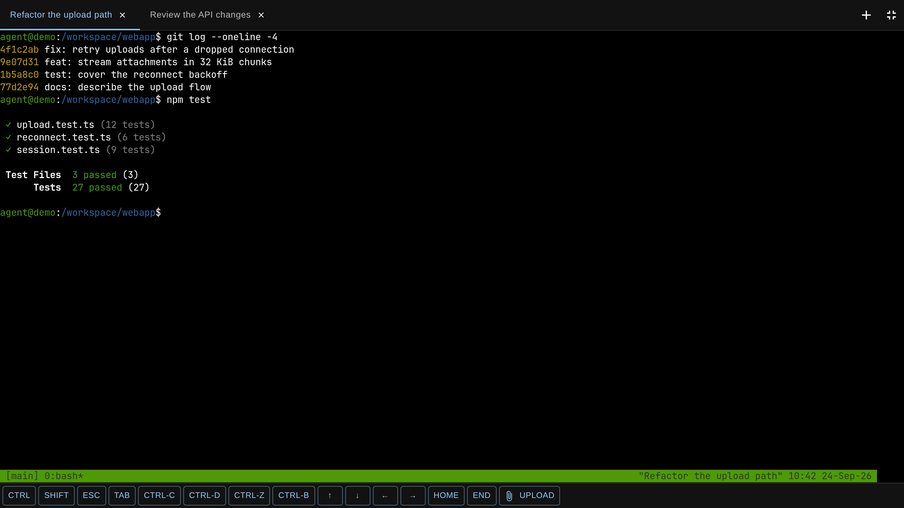

# headlamp-agent-sandbox

A [Headlamp](https://headlamp.dev/) plugin for
[kubernetes-sigs/agent-sandbox](https://github.com/kubernetes-sigs/agent-sandbox).



## Features

- A list of `Sandbox` resources (`agents.x-k8s.io/v1beta1`) with readiness and
  expiry, plus create, suspend, resume and delete.
- Terminal tabs per sandbox. Each tab attaches to its own named `tmux` session,
  so you get independent shells instead of one shared screen.
- Drop a file or paste a screenshot to upload it to `/workspace/.attachments/`.
  Its path is typed into the prompt without submitting.
- `Ctrl`+click (`Cmd` on a Mac) opens a link and `Ctrl`+right-click copies it. Selecting text
  copies it. Hold `Shift` to select while tmux mouse mode is on.
- A key row for touch keyboards: `Esc`, `Tab`, `Ctrl-C`, arrows, `Home`/`End`,
  the tmux prefix, sticky `Ctrl` and `Shift`, upload, and fullscreen. Dragging
  scrolls tmux history, and the row stays above the on-screen keyboard.
- `Shift+Enter` sends `ESC CR`, which Claude Code reads as a newline.
- Launching an agent types its name into the shell, so shell functions apply
  and you land back at a prompt when it exits.
- JetBrainsMono Nerd Font is bundled, so every device draws the same glyphs.
  This is why `main.js` is a few megabytes.

Uploads use a separate `pods/exec` call that pipes base64 into the pod. The
sandbox needs no web server or credential of its own, and everything runs under
your own Headlamp session and RBAC.

## Requirements

- Headlamp v0.45 or newer.
- The agent-sandbox controller and its `Sandbox` CRD.
- RBAC in the sandbox namespace: `sandboxes` (list, get, create, update,
  delete), and `pods` and `pods/exec` (get, list, create).
- `tmux`, `base64`, `head` and `mv` in the sandbox image.

## Settings

| Setting | Default | Meaning |
|---|---|---|
| `namespace` | `agents` | Namespace the sandboxes live in. |
| `templateName` | `agent-session` | `SandboxTemplate` that new sandboxes copy `spec.podTemplate` and `spec.volumeClaimTemplates` from. |

The create dialog has no pod spec editor. The template stays owned by whatever
manages it, such as a GitOps repository.

## Installing

Each release is published to the Forgejo registry as
`git.macalinao.org/jj/headlamp-agent-sandbox:<YYYY.MDD.P>`. It can be pulled
without credentials. A same-day rebuild reuses the tag, so pin the digest.

The image only holds the built plugin at `/plugin/headlamp-agent-sandbox/`.
Copy it into Headlamp's plugin directory with an init container:

```yaml
spec:
  initContainers:
    - name: headlamp-agent-sandbox
      image: git.macalinao.org/jj/headlamp-agent-sandbox:<tag>@sha256:<digest>
      command: ['cp', '-a', '/plugin/.', '/headlamp/plugins/']
      volumeMounts:
        - name: headlamp-plugins
          mountPath: /headlamp/plugins
  containers:
    - name: headlamp
      args:
        - -plugins-dir=/headlamp/plugins
      volumeMounts:
        - name: headlamp-plugins
          mountPath: /headlamp/plugins
  volumes:
    - name: headlamp-plugins
      emptyDir: {}
```

## Development

```sh
npm install
npm start           # rebuild on change against a local Headlamp
npm run build       # production build
npm run test:unit
npm run lint
```

The `Dockerfile` only copies `dist/`, so run `npm run build` before
`docker build`.

## License

Apache-2.0, see [LICENSE](./LICENSE). The bundled font is under the SIL Open
Font License, and its icon sets are listed in `src/fonts/README.md`. The
`.woff2` files are the Regular and Bold `JetBrainsMonoNerdFontMono` faces from
Nerd Fonts v3.5.1 (`JetBrainsMono.tar.xz`, sha256
`04d5e8f903693f9dd13e16f867e994834e681eb3c72c0d337a770dcda09010cf`), converted
with `fonttools ttLib.woff2 compress`.
